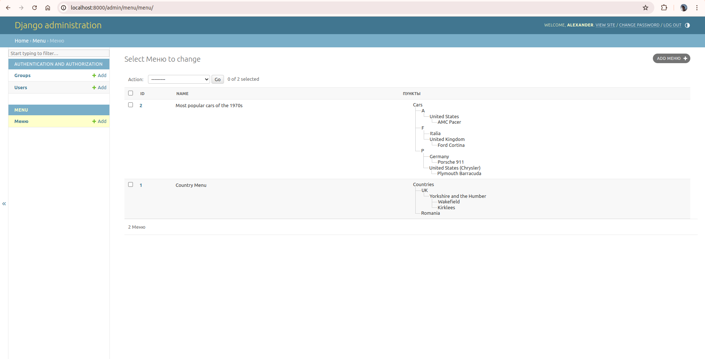
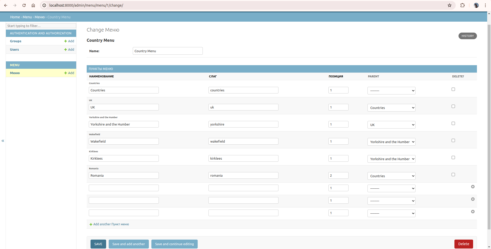
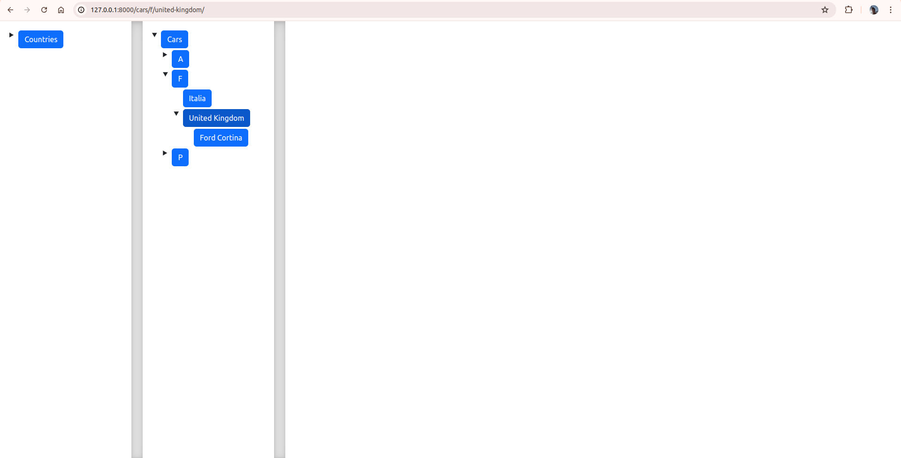
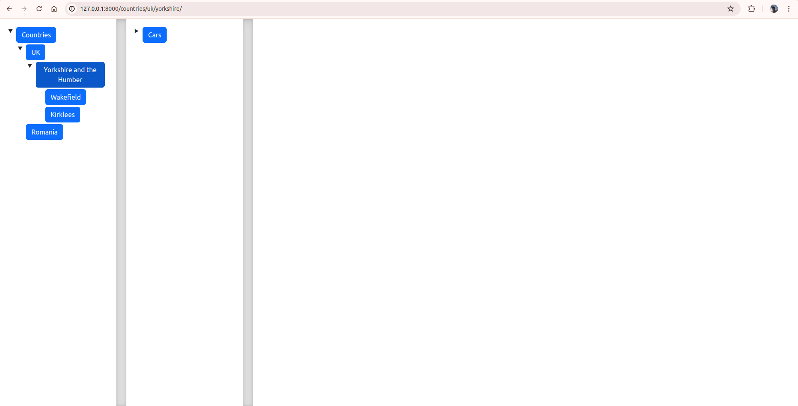
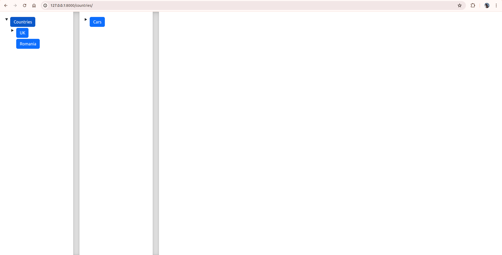

# EN
# Django application with a tree menu


## The technology stack of the project


## Features

- The menu module can be inserted into any third-party project to create tree-like menus in it.
- The menu supports any degree of nesting.
- A new menu is created through the admin panel.
- You can insert a new menu into the html template using the tag 
    ```
    
    ```
, where Country Menu is the name of the menu that the service administrator has set in the admin panel.
- When clicking on a menu item, the link corresponding to this item is clicked. At the same time, all parent items, as well as first-order sub-items, are expanded.
- The active menu item is determined based on the URL of the current page.

## Presentation
In the admin panel, on the page with the list of objects, a diagram is drawn showing the hierarchy of menu items

Menu items and sub-items can be created, assigned a slug and a parent element directly on the menu object page.

The URLs of the pages corresponding to the menu items are generated in models.py using @property based on the slug of the current one and all its parent objects.



Therefore, it is not necessary to specify a url for each menu item, it is enough to specify a slug. It may be worth adding its automatic generation based on the name, but I decided to leave the possibility of manual input for more flexibility in choosing an address.



When you click on a menu item, the corresponding url is clicked, and the child items of the selected one become visible.



## Installation and launch of the project


***Clone the repository and go to it on the command line:***

```
git clone git@github.com:your_username_in_github/django_tree_menu.git
```

***Create and activate a virtual environment:***
```
For Windows:
python -m venv env
source venv/Script/activate

For Linux/macOS:
python3 -m venv venv
source venv/bin/activate
```

### If your OS supports Makefile

If your OS supports running a Makefile, run the command in the root directory of the project

```
make setup
```
During its execution, dependencies will be installed, migrations will be performed, fixtures will be installed, and the server will be started.

Next, if necessary, you can create a superuser to view the admin panel.

To do this, run the command
```
make create-test-admin
```

### If your OS does not support make

***Install dependencies from a file requirements.txt:***

```
python -m pip install --upgrade pip
pip install -r requirements.txt
```

***Perform migrations***

```
python manage.py makemigrations
python manage.py migrate
```

***Upload prepared fixtures***
```
python manage.py loaddata data/db.json
```
***Start the development server***

```
python manage.py runserver
```

***Create a superuser***

```
python manage.py createsuperuser
```

### Links to view the demo

***Log in to the admin panel***

[http://localhost:8000/admin](http://localhost:8000/admin)

***View the main page with the demo menu***

[http://localhost:8000](http://localhost:8000)

## Author

Alexander Buchelnikov

[](https://t.me/aleksandr_buchelnikov)
[](https://www.linkedin.com/in/aleksandr-buchelnikov/)
[](mailto:al.buchelnikov@gmail.com)


# RU
# Django приложение с древовидным меню


## Стек технологий проекта


## Возможности

- Модуль menu можно вставлять в любой сторонний проект для создания в нем древовидных меню.
- Меню поддерживает любую степень вложенности.
- Новое меню создается через админ панель.
- Вставить новое меню в html шаблон можно с помощью тега 
    ```
    
    ```
    , где Country Menu - наименование меню, которое администратор сервиса задал в админ панели.
- При клике на пункт меню происходит переход по ссылке соответствующей данному пункту. При этом все родительские пункты, а также подпункты первого порядка развернуты.
- Активный пункт меню определяемя исходя из URL текущей страницы.

## Презентация
В админ панели на странице со списком объектов отрисовывается схема с отображением иерархии пунктов меню

Пункты и подпункты меню можно создать, назначить slug и родительский элемент непосредственно на странице объекта меню.

Url страниц, соответствующих пунктам меню генерируется в models.py с помощью @property на основе slug текущего и всех его родительских объектов.


Поэтому не нужно для каждого пункта меню прописывать url, достаточно указать slug. Возможно, стоит добавить его автоматическую генерацию на основе названия, но я решил оставить возможность ручного ввода для большей гибкости выбора адреса.


При нажатии на пункт меню происходит переход по соответствующему url, а также дочерние пункты выбранного становятся видимыми.


## Установка и запуск проекта


***Клонировать репозиторий и перейти в него в командной строке:***

```
git clone git@github.com:your_username_in_github/django_tree_menu.git
```

***Cоздать и активировать виртуальное окружение:***
```
Для Windows:
python -m venv env
source venv/Script/activate

Для Linux/MacOS:
python3 -m venv venv
source venv/bin/activate
```

### Если ваша OS поддерживает Makefile

Если ваша OS поддерживает запуск Makefile, в корневой директории проекта выполните команду

```
make setup
```
В процессе её выполнения будут установлены зависимости, выполнены миграции, установлены фикстуры, а также будет запущен сервер.

Далее при необходимости вы можете создать суперпользователя для просмотра админ панели.

Для этого выполните команду
```
make create-test-admin
```

### Если ваша OS не поддерживает make

***Установить зависимости из файла requirements.txt:***

```
python -m pip install --upgrade pip
pip install -r requirements.txt
```

***Выполнить миграции***

```
python manage.py makemigrations
python manage.py migrate
```

***Загрузить подготовленные фикстуры***
```
python manage.py loaddata data/db.json
```
***Запустить сервер разработки***

```
python manage.py runserver
```

***Создать суперпользователя***

```
python manage.py createsuperuser
```

### Ссылки для просмотра демо

***Зайти в админ панель***

[http://localhost:8000/admin](http://localhost:8000/admin)

***Посмотреть главную страницу с демо меню***

[http://localhost:8000](http://localhost:8000)

## Автор

Бучельников Александр

[](https://t.me/aleksandr_buchelnikov)
[](https://www.linkedin.com/in/aleksandr-buchelnikov/)
[](mailto:al.buchelnikov@gmail.com)